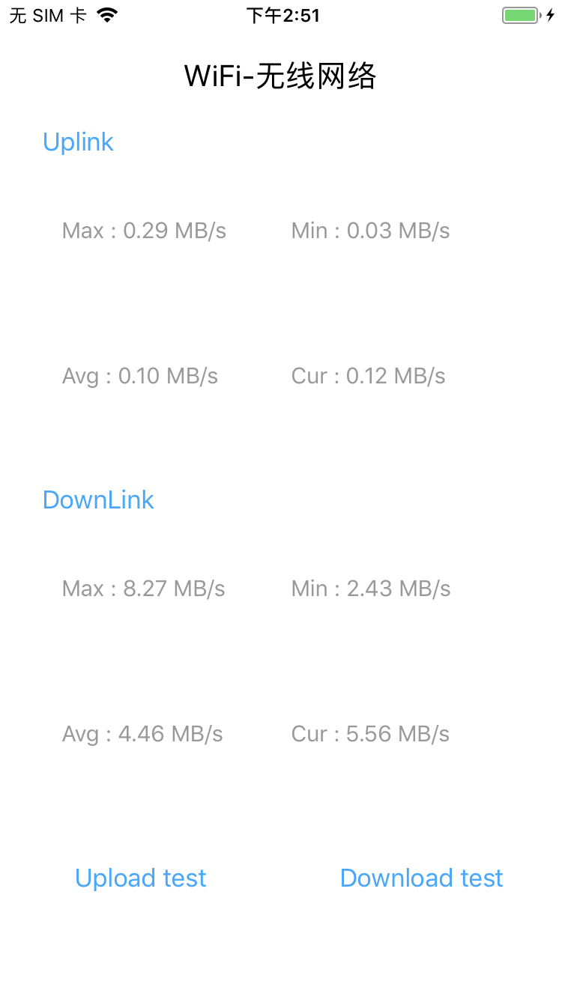

# NetSpeedMeasurer
#### 功能
* 简单实现网络上下行实时测速、最大最小网速 、平均网速

#### 原理
* 通过指定的时间间隔统计网卡的上下行流量来计算网速
* 统计的是整个系统的上下行流量，并非App内单个任务的流量

#### 使用
###### 初始化
```swift 
 RunsNetSpeedMeasurer *measurer = [[RunsNetSpeedMeasurer alloc] initWithAccuracyLevel:5 interval:1.0];
 //1.
 measurer.measurerBlock = ^(RunsNetMeasurerResult * _Nonnull result) {
 };
 
 or
 
 //2. RunsNetSpeedMeasurerDelegate
 measurer.delegate = self;
 
 ...
 
 #pragma mark -- RunsNetSpeedMeasurerDelegate
 - (void)measurer:(id<ISpeedMeasurerProtocol>)measurer didCompletedByInterval:(RunsNetMeasurerResult *)result {
 }
```

###### 开始和结束 必须手动结束
```Java
开始：
    [measurer execute];

结束：
    [measurer shutdown];
```

#### 示例图



If you believe you have identified a security vulnerability with NetSpeedMeasurer, you should report it as soon as possible via email to runs.wang.dev@gmail.com. Please do not post it to a public issue tracker.

##### License

NetSpeedMeasurer is released under the MIT license. See LICENSE for details.


